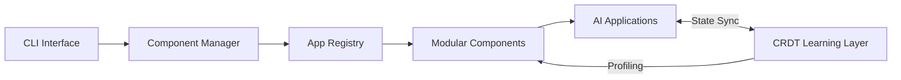

# SmartCRDT / SuperInstance


A modular, self-improving infrastructure layer for AI applications powered by CRDT technology.

## Quick Start

Get up and running with three commands:

```bash
superinstance pull router
superinstance app install chat-assistant
superinstance app run chat-assistant
```

## Architecture

SuperInstance routes requests, manages privacy, and adapts to hardware through pluggable components. The system learns from local usage patterns to optimize performance over time.



## Key Packages

| Package | Description |
|---------|-------------|
| core | Core infrastructure utilities |
| cli | Command-line interface |
| crdt-native | Native CRDT implementation |
| app-manager | Application lifecycle management |
| app-registry | Registry of available apps |
| config | Configuration management |
| manifest | Component manifest schema |
| learning | Usage-based learning system |
| embeddings | Text embedding generation |
| privacy | Data privacy handling |
| observability | Metrics and monitoring |
| persistence | State persistence layer |
| langgraph | LangGraph integration |
| langchain | LangChain integration |
| llamaindex | LlamaIndex integration |
| performance-optimizer | Automatic performance tuning |
| compatibility | Version compatibility layer |
| health-check | System health monitoring |
| cascade | Cascading state updates |
| coagents | Cooperative agent framework |

## Installation

Install the SuperInstance CLI to start building modular AI applications:

```bash
npm install -g @superinstance/cli
# Or download the binary from releases
```

## Contributing

We welcome contributions! Check out our [Contributing Guide](https://github.com/SuperInstance/SmartCRDT/blob/main/CONTRIBUTING.md) to get started.

## License

MIT © SuperInstance