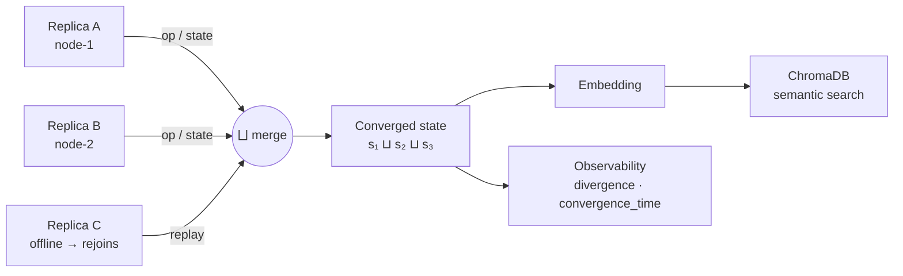

# SmartCRDT

**SmartCRDT** is a self-improving infrastructure platform for AI applications powered by Conflict-free Replicated Data Types (CRDTs). It provides distributed state management, vector search via ChromaDB, real-time observability, and a full Docker-based development stack as a TypeScript monorepo with optional Rust native modules.

<p align="center">
  
</p>

## Why It Matters

Distributed AI agents need shared state that survives network partitions, concurrent writes, and offline operation. Traditional distributed databases require consensus protocols (Paxos, Raft) that block under partition. CRDTs sidestep this entirely: their merge operation is mathematically guaranteed to converge regardless of operation order, making them **partition-tolerant by construction**. SmartCRDT packages production-grade CRDT types (G-Counter, PN-Counter, OR-Set, LWW-Register, RGA) with vector search integration, real-time merge dashboards, and Python bindings. This makes CRDT-based state management accessible to full-stack applications without requiring each developer to re-derive the commutativity proofs.

## How It Works

*Replicas that have never spoken still agree — every ledger, given the same entries, settles to the same page.*

### CRDT Fundamentals


```mermaid
flowchart LR
    A[Replica A<br/>node-1] -- "op / state" --> M(( ⨆ merge ))
    B[Replica B<br/>node-2] -- "op / state" --> M
    C[Replica C<br/>offline → rejoins] -- "replay" --> M
    M --> CA[Converged state<br/>s₁ ⊔ s₂ ⊔ s₃]
    CA --> V[Embedding]
    V --> X[ChromaDB<br/>semantic search]
    CA --> D[Observability<br/>divergence · convergence_time]
```

A CRDT is a data structure where all concurrent updates commute — any two replicas that receive the same set of updates (in any order) converge to the same state. There are two families:

**State-based (CvRDT)**: Replicas send their full state; merge is via a least-upper-bound (LUB) operation:
```
merge(s₁, s₂) = s₁ ⊔ s₂  (join semilattice)
```

**Operation-based (CmRDT)**: Replicas send operations; as long as operations commute, convergence is guaranteed:
```
apply(s, op₁ ∘ op₂) = apply(s, op₂ ∘ op₁)
```

### Implemented CRDT Types

| Type | Merge Semantics | Complexity |
|------|----------------|------------|
| G-Counter | Vector max element-wise | O(n) nodes |
| PN-Counter | (G-Counter+) − (G-Counter−) | O(n) |
| G-Set | Set union | O(\|S\|) |
| OR-Set | Element + unique-tag; union on merge | O(\|S\|) |
| LWW-Register | Highest timestamp wins | O(1) |
| LWW-Map | Per-key LWW registers | O(k) |
| RGA | Sequence with tombstones; merge by index | O(n) |

### Vector Search Integration

SmartCRDT integrates ChromaDB for semantic vector search alongside CRDT state:

```
Agent state (CRDT) → Embedding → ChromaDB → Top-K search
```

This enables queries like "find all agents whose current state is semantically similar to X" — even as agents continuously modify their state via CRDT operations.

### Observability Layer

Real-time dashboards track merge events, convergence latency, and divergence:

```
divergence(replicaA, replicaB) = |stateA △ stateB|
convergence_time = wall_clock(merge_complete) - wall_clock(update)
```

## Quick Start

### Docker (fastest)

```bash
git clone https://github.com/SuperInstance/SmartCRDT.git
cd SmartCRDT
docker-compose up -d  # PostgreSQL, Redis, ChromaDB, Ollama
```

### From source

```bash
pnpm install
pnpm build
pnpm test
```

### TypeScript usage

```typescript
import { GCounter, ORSet } from '@smartcrdt/crdt-core';

const counter = new GCounter('node-1');
counter.increment(3);
counter.increment(2);

const replica = new GCounter('node-2');
replica.increment(5);

counter.merge(replica);
console.log(counter.value); // 5 (3+2 from node-1, 5 from node-2)
```

## API

| Package | Key Types | Description |
|---------|-----------|-------------|
| `@smartcrdt/crdt-core` | GCounter, PNCounter, GSet, ORSet, LWWRegister, LWWMap, RGA | Core CRDT types |
| `@smartcrdt/crdt-merge` | merge strategies | Conflict resolution |
| `@smartcrdt/vector-store` | VectorStore (ChromaDB) | Semantic search |
| `@smartcrdt/observability` | MergeMonitor, DivergenceTracker | Real-time dashboards |
| `@smartcrdt/python-bridge` | PyCRDT bindings | Python interop |
| `@smartcrdt/native` | Rust WASM modules | Performance-critical ops |

## Architecture Notes

SmartCRDT is the distributed state backbone of SuperInstance. It embodies γ + η = C at the infrastructure level: γ is the constructive merge (G-Counter increment, OR-Set add) and η is the subtractive side (PN-Counter decrement, tombstone removal). CRDTs guarantee that γ and η commute — any order of constructive and subtractive operations converges to the same C (competence state). The vector store integration enables semantic queries over this state. See [ARCHITECTURE.md](https://github.com/SuperInstance/SuperInstance/blob/main/ARCHITECTURE.md).

## References

1. Shapiro, M., Preguiça, N., Baquero, C., & Zawirski, M. (2011). "Conflict-free replicated data types." *SSS*, LNCS 6976, 386–400. — Definitive CRDT paper.
2. Kleppmann, M. (2017). "Local-first software: You own your data." *Onward! Essays*. — CRDTs for offline-first applications.
3. Baquero, C., et al. (2014). "Composition of State-based CRDTs." *PaPEC*.

## License

MIT
