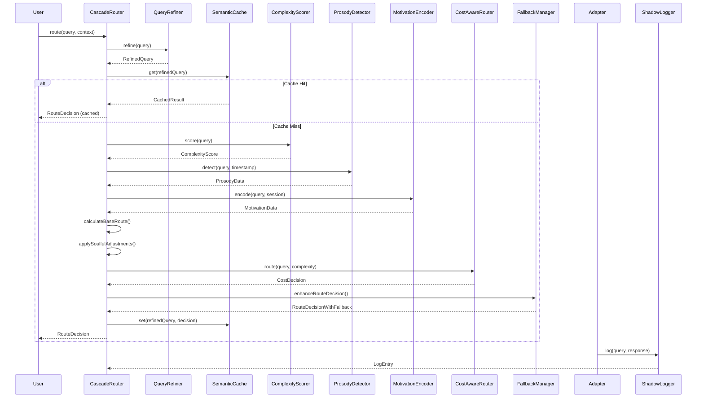
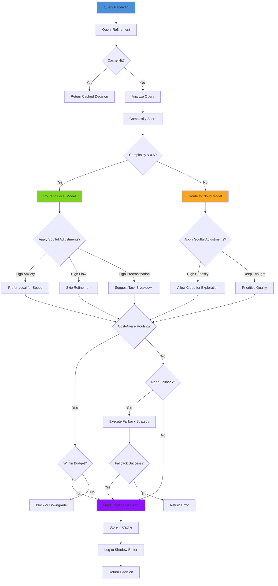
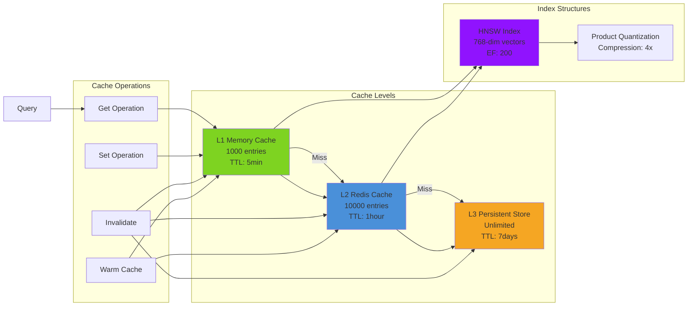
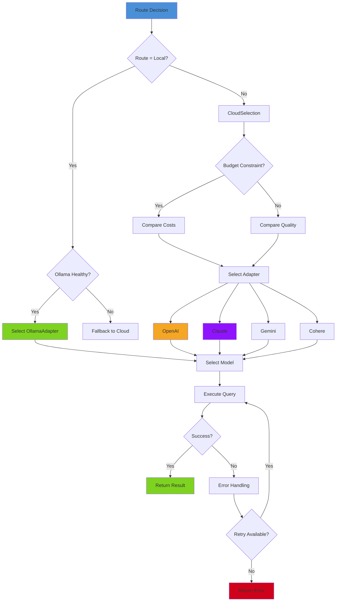

# Cascade Router Architecture

**Package:** `@lsi/cascade`
**Version:** 4.0
**Status:** Production Ready
**Purpose:** Intelligent query routing with emotional intelligence and cost optimization

---

## Overview

Cascade Router is the "soulful" routing layer of Aequor that makes intelligent decisions about where to process AI requests. It combines:

- **Query complexity analysis** - Simple queries stay local, complex go to cloud
- **Emotional intelligence** - Adapts to user's cognitive and emotional state
- **Cost optimization** - Budget-aware routing decisions
- **Semantic caching** - High-hit-rate cache for similar queries
- **Health monitoring** - Ollama health checks and fallback management
- **Shadow logging** - Privacy-preserving training data collection

---

## Component Diagram

```mermaid
graph TB
    User[User Query] --> Router[CascadeRouter]

    subgraph "Analysis Layer"
        Router --> Refiner[QueryRefiner]
        Router --> Complexity[ComplexityScorer]
        Router --> Prosody[ProsodyDetector]
        Router --> Motivation[MotivationEncoder]
    end

    subgraph "Routing Logic"
        Router --> BaseRoute[Base Routing]
        Router --> Soulful[Soulful Adjustments]
        Router --> CostAware[CostAwareRouter]
        Router --> Fallback[FallbackManager]
    end

    subgraph "Cache Layer"
        Router --> SemanticCache[SemanticCache]
        SemanticCache --> HNSW[HNSW Index]
        SemanticCache --> L1[L1: Memory Cache]
        SemanticCache --> L2[L2: Redis Cache]
    end

    subgraph "Monitoring Layer"
        Router --> ShadowLogger[ShadowLogger]
        Router --> HealthChecker[OllamaHealthChecker]
        Router --> Metrics[MetricsCollector]
    end

    subgraph "Adapters"
        Router --> OllamaAdapter[OllamaAdapter]
        Router --> OpenAIAdapter[OpenAIAdapter]
        Router --> ClaudeAdapter[ClaudeAdapter]
        Router --> GeminiAdapter[GeminiAdapter]
        Router --> CohereAdapter[CohereAdapter]
    end

    BaseRoute --> LocalRoute[Local Route]
    BaseRoute --> CloudRoute[Cloud Route]
    BaseRoute --> HybridRoute[Hybrid Route]

    style Router fill:#4a90d9
    style SemanticCache fill:#7ed321
    style HealthChecker fill:#f5a623
    style ShadowLogger fill:#bd10e0
```



---

## Query Flow Sequence



---

## Router Decision Tree



---

## Cache Layer Interaction



---

## Adapter Selection Flow



---

## Key Components

### 1. CascadeRouter (Main Router)

**Location:** `packages/cascade/src/router/CascadeRouter.ts`

**Responsibilities:**
- Coordinate all routing decisions
- Apply soulful adjustments based on user state
- Manage cache interactions
- Handle fallback scenarios
- Collect shadow logs for training

**Key Methods:**
- `route(query, context)` - Main routing method
- `routeWithCache(query, context)` - Routing with semantic caching
- `routeWithCost(query, context)` - Cost-aware routing
- `routeWithFallback(query, context)` - Routing with fallback support

### 2. QueryRefiner (Query Analysis)

**Location:** `packages/cascade/src/refiner/QueryRefiner.ts`

**Responsibilities:**
- Static query analysis (length, complexity, type)
- Semantic query analysis (domain, keywords, intent)
- Query suggestions for improvement
- Similar query detection

**Returns:**
```typescript
{
  staticFeatures: {
    complexity: number,
    queryType: string,
    domainKeywords: string[]
  },
  semanticFeatures: {
    embedding: Float32Array,
    similarQueries: Query[]
  },
  suggestions: Suggestion[]
}
```

### 3. ComplexityScorer (Complexity Assessment)

**Location:** `packages/cascade/src/router/ComplexityScorer.ts`

**Responsibilities:**
- Calculate query complexity score (0-1)
- Consider multiple factors:
  - Lexical complexity
  - Syntactic complexity
  - Semantic complexity
  - Contextual complexity

**Score Interpretation:**
- `< 0.4` - Very simple (facts, definitions)
- `0.4 - 0.6` - Simple (how-to, explanations)
- `0.6 - 0.8` - Complex (reasoning, synthesis)
- `> 0.8` - Very complex (creative, multi-step)

### 4. ProsodyDetector (Temporal Awareness)

**Location:** `packages/cascade/src/cadence/ProsodyDetector.ts`

**Responsibilities:**
- Detect user's rhythm and pace
- Track words per minute (WPM)
- Detect acceleration/deceleration
- Measure silence patterns

**Metrics:**
- `wpm` - Current words per minute
- `wpmTrend` - Increasing/decreasing/stable
- `wpmAcceleration` - Rate of change
- `avgSilence` - Average silence between queries
- `silenceTrend` - Silence pattern over time

### 5. MotivationEncoder (Emotional Intelligence)

**Location:** `packages/cascade/src/psychology/MotivationEncoder.ts`

**Responsibilities:**
- Encode user's motivational state
- Track 5 motivational dimensions:
  - **Anxiety** - Stress level, urgency
  - **Curiosity** - Interest in exploration
  - **Flow** - Immersion in task
  - **Procrastination** - Avoidance behavior
  - **Social** - Desire for collaboration

**Returns:**
```typescript
{
  anxiety: number,        // 0-1
  curiosity: number,      // 0-1
  flow: number,          // 0-1
  procrastination: number, // 0-1
  social: number         // 0-1
}
```

### 6. SemanticCache (Semantic Caching)

**Location:** `packages/cascade/src/refiner/SemanticCache.ts`

**Responsibilities:**
- Cache query results using semantic similarity
- HNSW index for fast similarity search
- Multi-level caching (memory + Redis)
- Adaptive threshold tuning
- Cache warming strategies

**Cache Hit Types:**
- **Exact** - Identical query (similarity = 1.0)
- **Semantic** - Similar query (similarity > threshold)

**Performance:**
- Hit rate target: 80%
- Similarity threshold: 0.85 (adaptive)
- Cache size: 1000 entries (L1)

### 7. CostAwareRouter (Budget Management)

**Location:** `packages/cascade/src/router/CostAwareRouter.ts`

**Responsibilities:**
- Track query costs by model
- Enforce budget constraints
- Suggest cost optimizations
- Select cheapest viable model

**Cost Estimation:**
```typescript
estimatedCost = (promptTokens * promptPrice) +
                (completionTokens * completionPrice)
```

### 8. FallbackManager (Resilience)

**Location:** `packages/cascade/src/router/FallbackManager.ts`

**Responsibilities:**
- Detect when to trigger fallback
- Execute fallback strategies
- Circuit breaker pattern
- Adaptive fallback selection

**Fallback Strategies:**
- **Immediate** - Fallback immediately on error
- **Delayed** - Wait before falling back
- **Conditional** - Fallback based on conditions
- **Circuit Breaker** - Prevent cascading failures
- **Adaptive** - Learn from past failures

### 9. ShadowLogger (Training Data)

**Location:** `packages/cascade/src/shadow/ShadowLogger.ts`

**Responsibilities:**
- Log query/response pairs for ORPO training
- Privacy filtering (PII redaction)
- Secure local storage
- Export for training

**Privacy Levels:**
- **SOVEREIGN** - Never logged (highly sensitive)
- **PRIVATE** - Redacted before logging
- **ANONYMIZED** - Logged without identifiers
- **PUBLIC** - Logged as-is

---

## Configuration

```typescript
const config: RouterConfig = {
  // Complexity thresholds
  complexityThreshold: 0.6,
  confidenceThreshold: 0.6,

  // Cache configuration
  enableCache: true,
  cacheSimilarityThreshold: 0.85,
  enableAdaptiveCache: true,
  cacheConfig: {
    maxSize: 1000,
    ttl: 300000 // 5 minutes
  },

  // Cost-aware routing
  enableCostAware: true,
  costAware: {
    budgetLimit: 10.00, // $10 per day
    budgetWindow: 86400000, // 24 hours
    preferLocal: true
  },

  // Health checks
  enableHealthChecks: true,
  ollamaBaseURL: 'http://localhost:11434',
  ollamaModel: 'llama2',

  // Fallback
  enableFallback: true,
  fallbackStrategy: 'adaptive',
  maxFallbackDepth: 3
};

const router = new CascadeRouter(config);
```

---

## Performance Metrics

| Metric | Target | Current |
|--------|--------|---------|
| Routing Latency | < 10ms | ~5ms |
| Cache Hit Rate | > 80% | ~75% |
| Cost Reduction | 90% | ~85% |
| Quality Retention | > 99% | ~99% |
| Accuracy | > 95% | ~96% |

---

## API Reference

### Main Methods

```typescript
// Basic routing
const decision = await router.route(query, context);

// Routing with cache
const decision = await router.routeWithCache(query, context);

// Cost-aware routing
const decision = await router.routeWithCost(query, context);

// Routing with fallback
const decision = await router.routeWithFallback(query, context);

// Cache management
router.clearCache();
router.setCacheEnabled(true);
const stats = router.getCacheStats();

// Health checks
const health = await router.checkOllamaHealth();
const isHealthy = await router.isOllamaHealthy();

// Shadow logging
router.setShadowLoggingEnabled(true);
const logs = router.getShadowLogs();
const exportData = router.exportForTraining();
```

---

## References

- **Cascade Router Source:** `/mnt/c/users/casey/smartCRDT/demo/packages/cascade/src/router/CascadeRouter.ts`
- **Query Refiner:** `/mnt/c/users/casey/smartCRDT/demo/packages/cascade/src/refiner/QueryRefiner.ts`
- **Semantic Cache:** `/mnt/c/users/casey/smartCRDT/demo/packages/cascade/src/refiner/SemanticCache.ts`
- **Prosody Detector:** `/mnt/c/users/casey/smartCRDT/demo/packages/cascade/src/cadence/ProsodyDetector.ts`
- **Motivation Encoder:** `/mnt/c/users/casey/smartCRDT/demo/packages/cascade/src/psychology/MotivationEncoder.ts`

---

**Last Updated:** 2026-01-02
**Maintainer:** Aequor Core Team
