# Data Flow Architecture

**Version:** 4.0
**Status:** Production Ready
**Purpose:** End-to-end request processing flows for Aequor

---

## Overview

This document describes the complete data flow through the Aequor system, from user query to response, including all caching, error handling, and optimization paths.

---

## End-to-End Request Flow

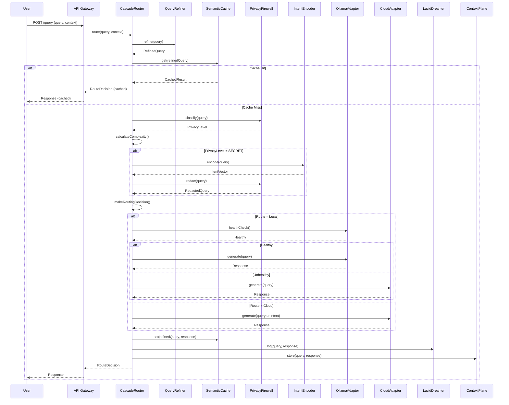

---

## Error Handling Flow

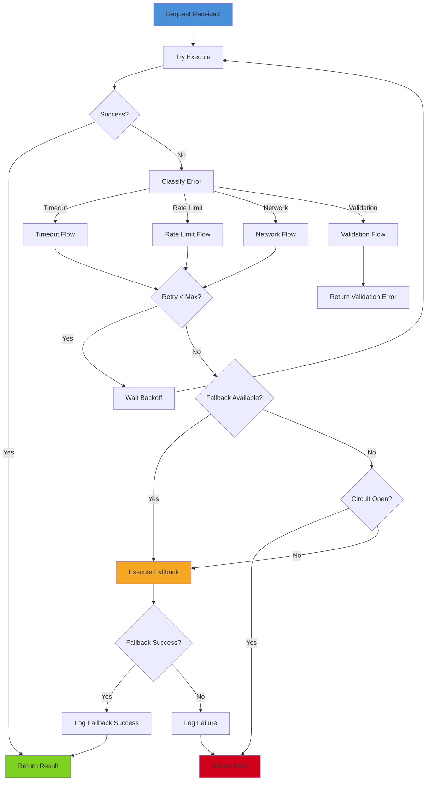

---

## Cache Hit/Miss Flows

### Cache Hit Flow

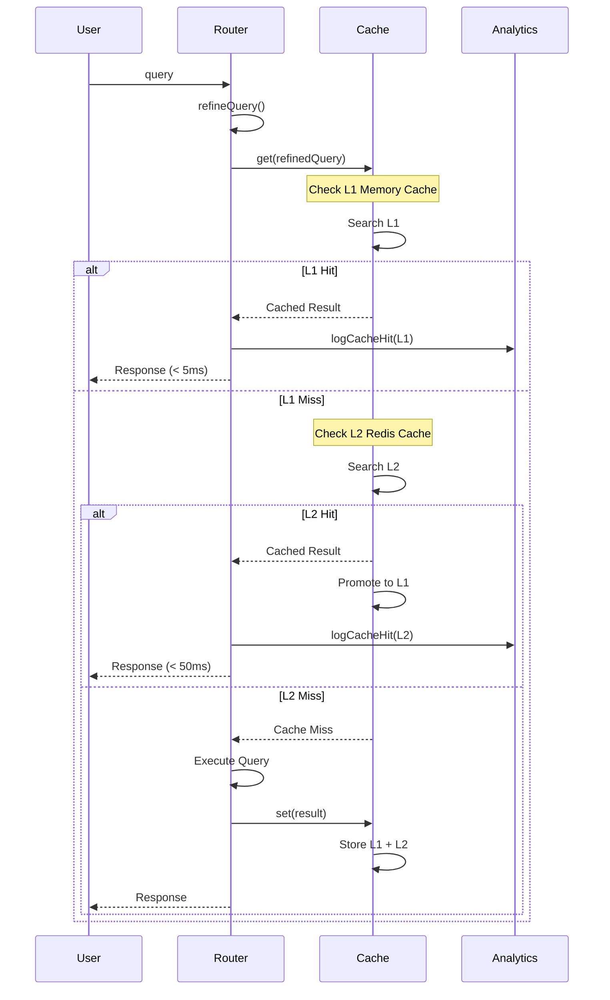

### Cache Miss Flow

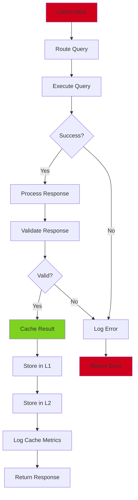

---

## Privacy Flow

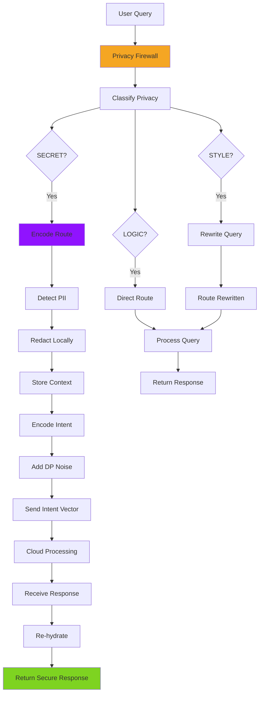

---

## Fallback Flow

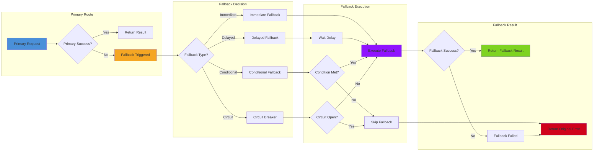

---

## Learning Flow

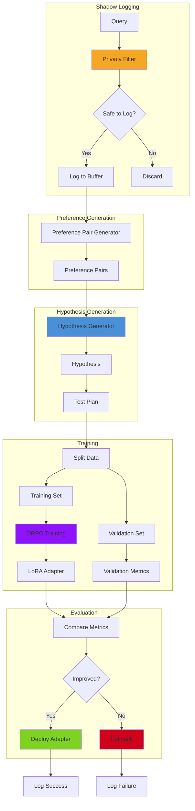

---

## Multi-Model Collaboration Flow

```mermaid
sequenceDiagram
    participant Client
    participant Router
    participant ACP as ACPHandshake
    participant Model1 as Model 1
    participant Model2 as Model 2
    participant Model3 as Model 3
    participant Aggregator as Aggregator

    Client->>Router: query (complex)

    Router->>ACP: initiateHandshake(query)

    ACP->>ACP: analyzeComplexity(query)
    ACP->>ACP: selectModels()

    ACP->>Model1: canHandle(query)?
    Model1-->>ACP: CapabilityProfile

    ACP->>Model2: canHandle(query)?
    Model2-->>ACP: CapabilityProfile

    ACP->>Model3: canHandle(query)?
    Model3-->>ACP: CapabilityProfile

    ACP->>ACP: createExecutionPlan()

    ACP-->>Router: ExecutionPlan {
        models: [Model1, Model2],
        aggregation: "weighted_vote"
    }

    par Parallel Execution
        Router->>Model1: execute(query)
        Router->>Model2: execute(query)
    end

    Model1-->>Router: response1
    Model2-->>Router: response2

    Router->>Aggregator: aggregate([response1, response2])

    Aggregator->>Aggregator: applyWeights()
    Aggregator->>Aggregator: resolveConflicts()
    Aggregator->>Aggregator: synthesize()

    Aggregator-->>Router: aggregatedResponse

    Router-->>Client: finalResponse
```

---

## Cartridge Loading Flow

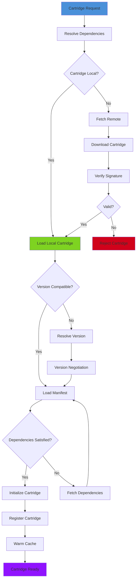

---

## Tenant Isolation Flow

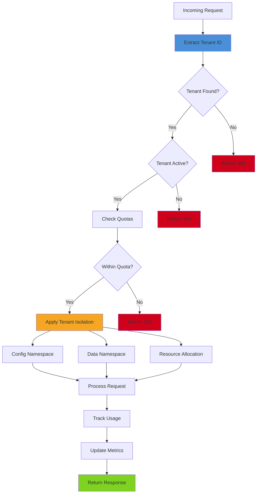

---

## Performance Optimization Flow

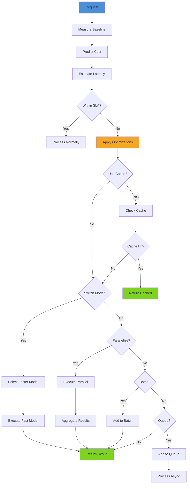

---

## Metrics Collection Flow

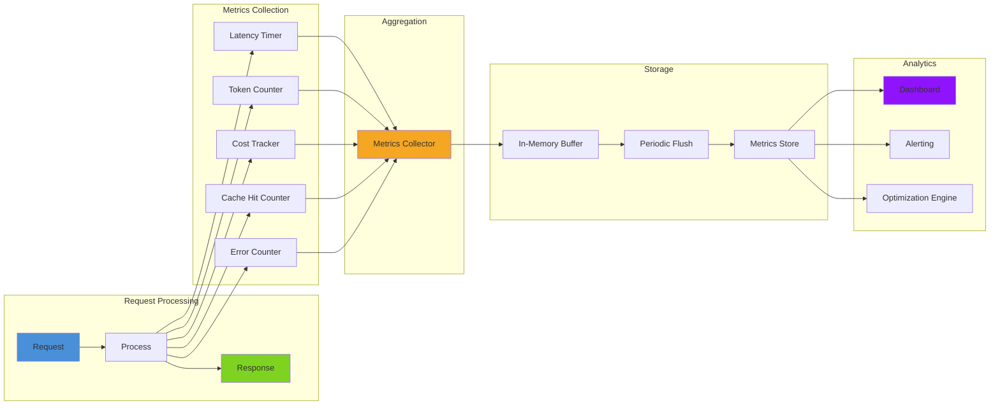

---

## Flow State Diagrams

### Request Lifecycle State Machine

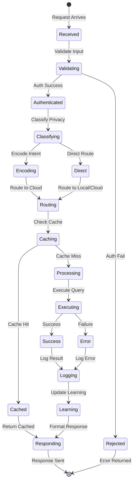

---

## Configuration Flows

### Configuration Loading Flow

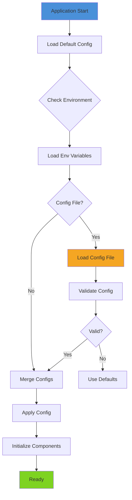

---

## References

- **Cascade Router:** `cascade-architecture.md`
- **Privacy Suite:** `privacy-architecture.md`
- **SuperInstance:** `superinstance-architecture.md`
- **Protocol Types:** `/mnt/c/users/casey/smartCRDT/demo/packages/protocol/src/index.ts`

---

**Last Updated:** 2026-01-02
**Maintainer:** Aequor Core Team
