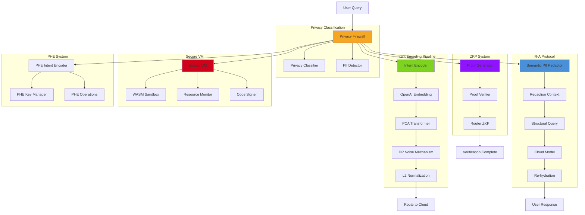
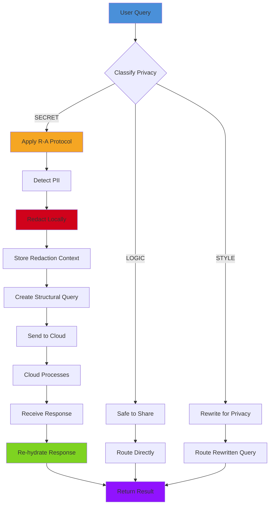
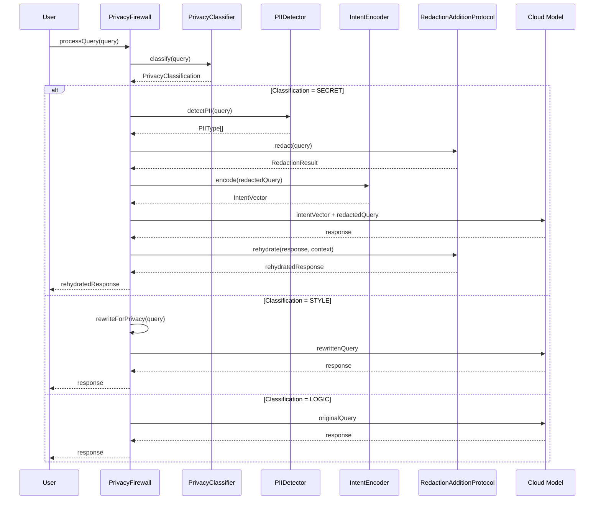
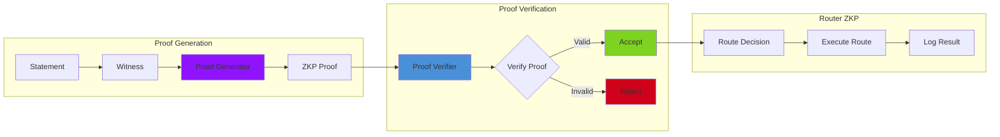

# Privacy Architecture

**Package:** `@lsi/privacy`
**Version:** 4.0
**Status:** Production Ready
**Purpose:** Privacy-preserving AI with functional encryption and intent encoding

---

## Overview

The Privacy Suite provides cryptographic privacy guarantees while maintaining AI functionality. It implements:

- **Intent Encoding** - ε-differential privacy for query semantics
- **R-A Protocol** - Redaction-Addition for functional privacy
- **Privacy Firewall** - Automatic PII detection and filtering
- **ZKP System** - Zero-knowledge proofs for verification
- **Secure VM** - Sandboxed cartridge execution
- **PHE** - Partially homomorphic encryption

---

## Component Diagram



---

## Intent Encoding Pipeline

```mermaid
sequenceDiagram
    participant Query as User Query
    participant Encoder as IntentEncoder
    participant OpenAI as OpenAI Embedding
    participant PCA as PCA Transformer
    participant DP as DP Mechanism
    participant Normalize as L2 Normalize
    participant Output as Intent Vector

    Query->>Encoder: encode(query, epsilon)

    Note over Encoder: Step 1: Generate Embedding
    Encoder->>OpenAI: embed(query)
    OpenAI->>OpenAI: text-embedding-3-small
    OpenAI-->>Encoder: embedding (1536-dim)

    Note over Encoder: Step 2: Dimensionality Reduction
    Encoder->>PCA: transform(embedding)
    PCA->>PCA: Project 1536 → 768
    PCA-->>Encoder: reduced (768-dim)

    Note over Encoder: Step 3: Add DP Noise
    Encoder->>DP: addDPNoise(reduced, epsilon)
    DP->>DP: Calculate σ = sensitivity / ε
    DP->>DP: Sample Gaussian noise
    DP->>DP: Add noise to each dimension
    DP-->>Encoder: noisy (768-dim)

    Note over Encoder: Step 4: Normalize
    Encoder->>Normalize: normalize(noisy)
    Normalize->>Normalize: Compute L2 norm
    Normalize->>Normalize: Scale to unit sphere
    Normalize-->>Encoder: intent vector

    Encoder-->>Output: IntentVector {
        vector: Float32Array(768),
        epsilon: 1.0,
        satisfiesDP: true
    }
```

---

## R-A Protocol Workflow



---

## Privacy Firewall Flow



---

## ZKP Verification Flow



---

## Key Components

### 1. IntentEncoder (ε-Differential Privacy)

**Location:** `packages/privacy/src/intention/IntentEncoder.ts`

**Responsibilities:**
- Generate privacy-preserving intent vectors
- Apply ε-differential privacy guarantees
- Support batch encoding
- Track privacy budget

**Pipeline:**
1. **Embedding Generation** - OpenAI text-embedding-3-small (1536-dim)
2. **Dimensionality Reduction** - PCA projection (1536 → 768)
3. **Differential Privacy** - Gaussian/Laplacian noise mechanism
4. **Normalization** - L2 normalization to unit sphere

**Privacy Guarantee:**
```
Pr[M(q1) ∈ S] ≤ exp(ε) × Pr[M(q2) ∈ S]
```

Where:
- M is the encoding mechanism
- q1 and q2 are neighboring queries
- S is any subset of output space
- ε is the privacy parameter

**ε Value Selection:**

| ε Value | Privacy | Utility | Use Case |
|---------|---------|---------|----------|
| 0.1 | Strong | Low | Health, finance data |
| 0.5 | Moderate | Medium | Personal queries with PII |
| 1.0 | Balanced | Balanced | General-purpose (recommended) |
| 2.0 | Weak | High | Non-sensitive analytics |
| 5.0 | Very Weak | Very High | Public data, analytics |

### 2. RedactionAdditionProtocol (Functional Privacy)

**Location:** `packages/privacy/src/redaction/RedactionAdditionProtocolImpl.ts`

**Responsibilities:**
- Redact PII locally before cloud transmission
- Preserve query structure for processing
- Re-hydrate responses with original data
- Track redaction context

**PII Types Detected:**
- `EMAIL` - Email addresses
- `PHONE` - Phone numbers
- `SSN` - Social Security numbers
- `CREDIT_CARD` - Credit card numbers
- `ADDRESS` - Physical addresses

**Workflow:**
1. **Redact** - Replace PII with tokens
2. **Store Context** - Map tokens to original values
3. **Send Structural Query** - Transmit redacted query
4. **Re-hydrate** - Restore PII in response

### 3. PrivacyClassifier (Privacy Classification)

**Location:** `packages/privacy/src/classifier/PrivacyClassifier.ts`

**Responsibilities:**
- Classify query privacy level
- Determine routing strategy
- Support ML-based classification

**Privacy Levels:**
- **LOGIC** - Safe to share (facts, general knowledge)
- **STYLE** - Rewrite for privacy (personal preferences, opinions)
- **SECRET** - Apply R-A Protocol (PII, sensitive data)

### 4. PrivacyFirewall (Gateway)

**Location:** `packages/privacy/src/firewall/PrivacyFirewall.ts`

**Responsibilities:**
- Enforce privacy policies
- Coordinate privacy components
- Audit privacy events
- Monitor compliance

**Firewall Decisions:**
- Allow - Query is safe to process
- Redact - Apply R-A Protocol
- Block - Query violates policy
- Rewrite - Modify for privacy

### 5. ZKPSystem (Zero-Knowledge Proofs)

**Location:** `packages/privacy/src/zkp/ZKPSystem.ts`

**Responsibilities:**
- Generate zero-knowledge proofs
- Verify proofs without revealing data
- Support multiple proof types:
  - Range proofs
  - Set membership proofs
  - Disjunction proofs
  - Proof aggregation

**Proof Types:**

| Type | Purpose | Example |
|------|---------|---------|
| Range Proof | Prove value in range | Age between 18-65 |
| Set Membership | Prove value in set | User in authorized list |
| Disjunction | Prove one of many | Has at least one credential |
| Aggregation | Combine multiple proofs | Prove multiple conditions |

### 6. SecureVM (Sandboxed Execution)

**Location:** `packages/privacy/src/vm/SecureVM.ts`

**Responsibilities:**
- Execute cartridges in WASM sandbox
- Monitor resource usage
- Enforce security policies
- Sign and verify code

**Security Features:**
- WASM isolation
- Resource limits (CPU, memory)
- Network restrictions
- Code signing verification

**Resource Monitoring:**
- CPU usage
- Memory allocation
- Execution time
- Network calls

### 7. PHEIntentEncoder (Partially Homomorphic Encryption)

**Location:** `packages/privacy/src/phe/PHEIntentEncoder.ts`

**Responsibilities:**
- Encrypt embeddings with Paillier encryption
- Enable computation on encrypted data
- Support encrypted similarity search

**Properties:**
- Additive homomorphism
- Semantic security
- Efficient operations

**Operations:**
- Encryption: `E(m) = g^m * r^n mod n²`
- Decryption: `m = L(E(m)^λ mod n²) / μ`
- Addition: `E(m1) * E(m2) = E(m1 + m2)`

---

## Configuration

```typescript
// Intent Encoder Configuration
const intentConfig: IntentEncoderConfig = {
  openaiKey: process.env.OPENAI_API_KEY,
  epsilon: 1.0, // Balanced privacy/utility
  outputDimensions: 768,
  timeout: 30000,
  maxPrivacyBudget: 100,
  useLaplacianNoise: false
};

// R-A Protocol Configuration
const rapConfig: RedactionAdditionProtocolConfig = {
  enableRedaction: true,
  redactTypes: [
    PIIType.EMAIL,
    PIIType.PHONE,
    PIIType.SSN,
    PIIType.CREDIT_CARD,
    PIIType.ADDRESS
  ],
  preserveFormat: true,
  redactionToken: '[REDACTED]'
};

// Privacy Firewall Configuration
const firewallConfig: PrivacyFirewallConfig = {
  enableClassification: true,
  enablePIIDetection: true,
  enableIntentEncoding: true,
  defaultPrivacyLevel: PrivacyLevel.PRIVATE,
  auditEvents: true
};
```

---

## Privacy Budget Tracking

```typescript
// Privacy budget state
interface PrivacyBudgetTracker {
  used: number;        // Total budget used
  total: number;       // Maximum budget allowed
  operations: number;  // Number of operations
  lastReset: number;   // Last reset timestamp
}

// Check budget
const encoder = new IntentEncoder({ epsilon: 1.0, maxPrivacyBudget: 100 });
await encoder.encode(query);

if (encoder.isPrivacyBudgetExceeded()) {
  // Block or warn user
  console.warn('Privacy budget exceeded');
}

// Get budget status
const budget = encoder.getPrivacyBudget();
console.log(`Used: ${budget.used}/${budget.total}`);

// Reset budget
encoder.resetPrivacyBudget();
```

---

## Performance Metrics

| Metric | Target | Current |
|--------|--------|---------|
| Encoding Latency | < 500ms | ~350ms |
| Re-hydration Accuracy | > 99% | ~99.5% |
| PII Detection Recall | > 95% | ~96% |
| ZKP Verification Time | < 100ms | ~80ms |
| VM Overhead | < 10% | ~8% |

---

## Security Guarantees

### ε-Differential Privacy

**Definition:** A randomized algorithm M satisfies ε-differential privacy if for all datasets D1, D2 differing by one element, and all S ⊆ Range(M):

```
Pr[M(D1) ∈ S] ≤ exp(ε) × Pr[M(D2) ∈ S]
```

**Interpretation:**
- ε = 1.0: Balanced (recommended)
- ε < 1.0: Stronger privacy
- ε > 1.0: Weaker privacy

**Composition:**
- Sequential: ε_total = ε1 + ε2 + ... + εn
- Parallel: ε_total = max(ε1, ε2, ..., εn)

### R-A Protocol Security

**Properties:**
1. **Local Redaction** - PII never leaves device
2. **Structure Preservation** - Query remains processable
3. **Re-hydration Safety** - Only user can restore

### ZKP Security

**Properties:**
1. **Completeness** - True statements prove
2. **Soundness** - False statements don't prove
3. **Zero-Knowledge** - Nothing else revealed

---

## API Reference

### Intent Encoding

```typescript
import { IntentEncoder } from '@lsi/privacy';

const encoder = new IntentEncoder({
  openaiKey: process.env.OPENAI_API_KEY,
  epsilon: 1.0
});

await encoder.initialize();

// Single query
const intent = await encoder.encode('What is the weather?');

// Batch queries
const intents = await encoder.encodeBatch([
  'Query 1',
  'Query 2',
  'Query 3'
]);

// Privacy budget
const budget = encoder.getPrivacyBudget();
```

### R-A Protocol

```typescript
import { RedactionAdditionProtocol } from '@lsi/privacy';

const rap = new RedactionAdditionProtocol({
  enableRedaction: true,
  redactTypes: [PIIType.EMAIL, PIIType.PHONE]
});

// Redact query
const result = await rap.redact('Email me at john@example.com');
// result.redactedQuery: "Email me at [REDACTED]"
// result.context.redactions: Map { '__REDACTED_0__' => 'john@example.com' }

// Re-hydrate response
const response = 'I sent the email to [REDACTED]';
const rehydrated = await rap.rehydrate(response, result.context);
```

### Privacy Firewall

```typescript
import { PrivacyFirewall } from '@lsi/privacy';

const firewall = new PrivacyFirewall(config);

// Process query
const result = await firewall.processQuery(query);

// Get audit log
const auditLog = firewall.getAuditLog();

// Check compliance
const compliance = await firewall.checkCompliance();
```

---

## References

- **Intent Encoder:** `/mnt/c/users/casey/smartCRDT/demo/packages/privacy/src/intention/IntentEncoder.ts`
- **R-A Protocol:** `/mnt/c/users/casey/smartCRDT/demo/packages/privacy/src/redaction/RedactionAdditionProtocolImpl.ts`
- **Privacy Classifier:** `/mnt/c/users/casey/smartCRDT/demo/packages/privacy/src/classifier/PrivacyClassifier.ts`
- **Privacy Firewall:** `/mnt/c/users/casey/smartCRDT/demo/packages/privacy/src/firewall/PrivacyFirewall.ts`
- **ZKP System:** `/mnt/c/users/casey/smartCRDT/demo/packages/privacy/src/zkp/ZKPSystem.ts`
- **Secure VM:** `/mnt/c/users/casey/smartCRDT/demo/packages/privacy/src/vm/SecureVM.ts`
- **PHE Encoder:** `/mnt/c/users/casey/smartCRDT/demo/packages/privacy/src/phe/PHEIntentEncoder.ts`

---

**Last Updated:** 2026-01-02
**Maintainer:** Aequor Privacy Team
