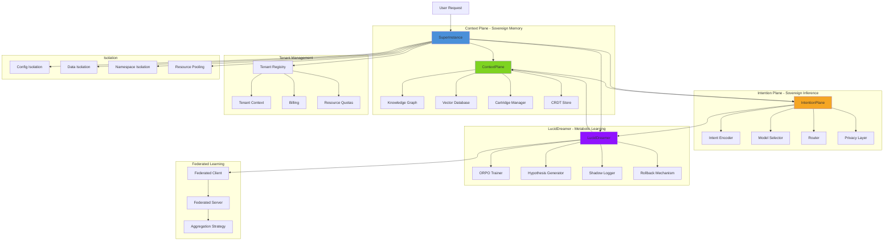
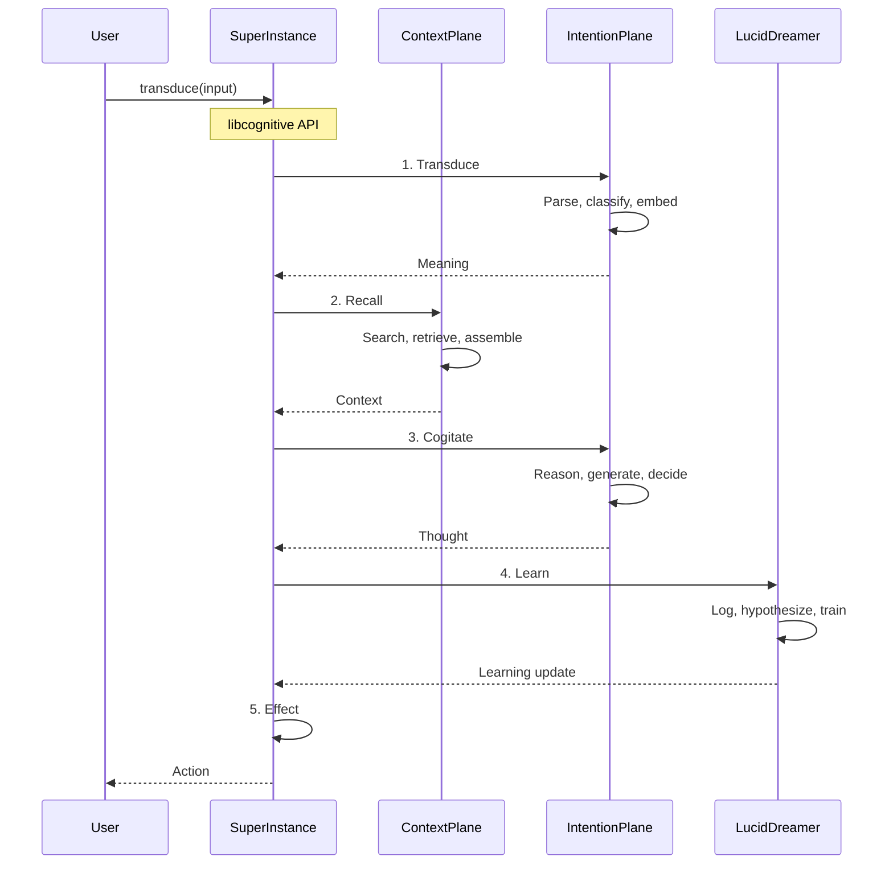
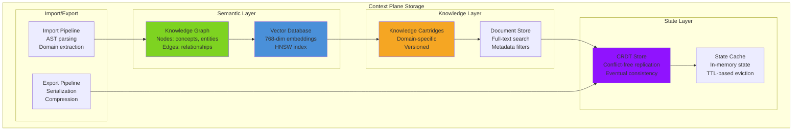
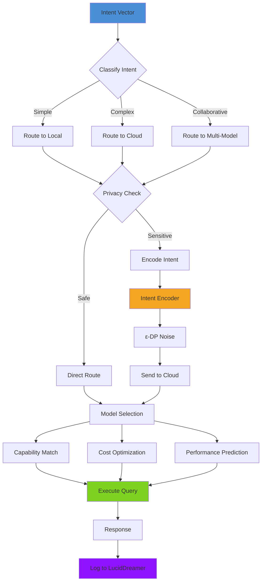

# SuperInstance Architecture

**Package:** `@lsi/superinstance`
**Version:** 4.0
**Status:** In Development (~60% complete)
**Purpose:** Three-plane cognitive architecture with sovereign memory and learning

---

## Overview

SuperInstance is the cognitive orchestration layer that combines three planes of intelligence:

- **Context Plane** - Sovereign memory (semantic graph, vectors, knowledge cartridges)
- **Intention Plane** - Sovereign inference (intent encoding, model selection)
- **LucidDreamer** - Metabolic learning (ORPO training, hypothesis generation)

SuperInstance implements the **libcognitive API** - four primitives for AI orchestration:

```typescript
lsi.transduce(input)      // Data → Meaning
lsi.recall(signal)        // Meaning → Context
lsi.cogitate(signal, ctx) // Meaning + Context → Thought
lsi.effect(thought)       // Thought → Action
```

---

## Component Diagram



---

## Three-Plane Interaction



---

## Context Plane Storage



---

## Intention Plane Routing



---

## LucidDreamer Learning Loop

```mermaid
graph LR
    subgraph "Shadow Logging"
        Query[Query] --> PrivacyFilter[Privacy Filter]
        PrivacyFilter --> LogBuffer[Log Buffer]
        LogBuffer --> PreferencePair[Preference Pair]
    end

    subgraph "Hypothesis Generation"
        PreferencePair --> HypothesisGen[Hypothesis Generator]
        HypothesisGen --> Hypothesis[Hypothesis]
        Hypothesis --> TestPlan[Test Plan]
    end

    subgraph "ORPO Training"
        TestPlan --> TrainingData[Training Data]
        TrainingData --> ORPO[ORPO Trainer]
        ORPO --> LoRA[LoRA Adapter]
        LoRA --> ModelUpdate[Model Update]
    end

    subgraph "Validation & Rollback"
        ModelUpdate --> Metrics[Metrics Snapshot]
        Metrics --> Compare{Compare Metrics}
        Compare -->|Improved| Deploy[Deploy Update]
        Compare -->|Degraded| Rollback[Rollback]
    end

    Rollback --> HypothesisGen

    style PrivacyFilter fill:#f5a623
    style HypothesisGen fill:#4a90d9
    style ORPO fill:#9013fe
    style Deploy fill:#7ed321
    style Rollback fill:#d0021b
```



---

## Key Components

### 1. ContextPlane (Sovereign Memory)

**Location:** `packages/superinstance/src/context/ContextPlane.ts`

**Responsibilities:**
- Store and retrieve knowledge
- Manage semantic graph
- Handle vector embeddings
- Load knowledge cartridges
- CRDT-based state synchronization

**Storage Types:**
- **Knowledge Graph** - Nodes and edges for concepts and relationships
- **Vector Database** - 768-dim embeddings with HNSW index
- **Document Store** - Full-text searchable documents
- **CRDT Store** - Conflict-free replicated state

**Key Methods:**
```typescript
// Store knowledge
await context.store(item);

// Retrieve by semantic similarity
const results = await context.retrieve(query, topK);

// Import from codebase
await context.import(codebase);

// Export to cartridge
const cartridge = await context.export();
```

### 2. IntentionPlane (Sovereign Inference)

**Location:** `packages/superinstance/src/intention/IntentionPlane.ts`

**Responsibilities:**
- Encode user intent
- Select appropriate models
- Route queries optimally
- Apply privacy constraints

**Pipeline:**
1. **Intent Encoding** - Convert query to intent vector
2. **Privacy Classification** - Determine privacy level
3. **Model Selection** - Choose best model
4. **Query Routing** - Route to selected model
5. **Response Processing** - Handle and validate response

**Key Methods:**
```typescript
// Transduce input to meaning
const meaning = await intention.transduce(input);

// Recall context for meaning
const context = await intention.recall(meaning);

// Cogitate thought from meaning + context
const thought = await intention.cogitate(meaning, context);
```

### 3. LucidDreamer (Metabolic Learning)

**Location:** `packages/superinstance/src/luciddreamer/LucidDreamer.ts`

**Responsibilities:**
- Shadow logging for training data
- Hypothesis generation
- ORPO training
- Rollback mechanism

**Learning Loop:**
1. **Observe** - Log query/response pairs
2. **Hypothesize** - Generate testable hypotheses
3. **Train** - ORPO training with shadow logs
4. **Validate** - Compare metrics before/after
5. **Deploy** - Apply improvements or rollback

**Key Methods:**
```typescript
// Log query/response for training
await lucid.log(query, response, metadata);

// Generate hypothesis from observations
const hypothesis = await lucid.generateHypothesis();

// Train model with shadow logs
const result = await lucid.train();

// Rollback to previous checkpoint
await lucid.rollback(checkpointId);
```

### 4. FederatedClient (Distributed Training)

**Location:** `packages/superinstance/src/federated/FederatedClient.ts`

**Responsibilities:**
- Participate in federated rounds
- Train on local data
- Submit model updates
- Apply aggregated updates

**Federated Learning Flow:**
1. Receive global model from server
2. Train on local shadow logs
3. Compute model update (gradient)
4. Apply differential privacy to update
5. Submit update to server
6. Receive aggregated update
7. Apply to local model

### 5. FederatedServer (Aggregation)

**Location:** `packages/superinstance/src/federated/FederatedServer.ts`

**Responsibilities:**
- Coordinate federated rounds
- Select clients for training
- Aggregate model updates
- Broadcast global model

**Aggregation Strategies:**
- **FedAvg** - Weighted average of updates
- **FedProx** - Proximal term for stability
- **Secure Aggregation** - Encrypted aggregation

### 6. TenantRegistry (Multi-Tenancy)

**Location:** `packages/superinstance/src/tenant/TenantRegistry.ts`

**Responsibilities:**
- Register and manage tenants
- Enforce resource quotas
- Handle billing
- Isolate tenant data

**Tenant Isolation:**
- **Config Isolation** - Separate configurations
- **Data Isolation** - Separate data namespaces
- **Resource Quotas** - Per-tenant limits
- **Billing** - Usage-based billing

---

## libcognitive API

The four primitives that form the core API:

### 1. transduce(input) - Data → Meaning

Convert raw input into structured meaning.

```typescript
const meaning = await lsi.transduce("What is TypeScript?");

// Returns:
{
  semantic: {
    embedding: Float32Array(768),
    intent: "information_seeking",
    confidence: 0.95
  },
  syntactic: {
    tokens: ["what", "is", "typescript"],
    pos: ["PRON", "VERB", "NOUN"],
    entities: ["TypeScript"]
  },
  complexity: 0.3
}
```

### 2. recall(signal) - Meaning → Context

Retrieve relevant context for a meaning signal.

```typescript
const context = await lsi.recall(meaning);

// Returns:
{
  items: [
    {
      type: "knowledge",
      content: "TypeScript is a typed superset of JavaScript",
      relevance: 0.92,
      source: "docs/typescript.md"
    },
    {
      type: "similar_query",
      query: "What is TypeScript?",
      response: "...",
      similarity: 0.95
    }
  ],
  summary: "Found 5 relevant items from knowledge base and query history"
}
```

### 3. cogitate(signal, context) - Meaning + Context → Thought

Generate a thought by combining meaning and context.

```typescript
const thought = await lsi.cogitate(meaning, context);

// Returns:
{
  content: "TypeScript is a strongly typed programming language...",
  reasoning: "Based on the knowledge base entries...",
  confidence: 0.94,
  model: "gpt-4",
  metadata: {
    latency: 150,
    tokens: 250,
    fromCache: false
  }
}
```

### 4. effect(thought) - Thought → Action

Execute an action based on a thought.

```typescript
const action = await lsi.effect(thought);

// Returns:
{
  type: "response",
  content: "TypeScript is a typed superset of JavaScript...",
  format: "markdown",
  delivered: true,
  metadata: {
    timestamp: 1234567890,
    sessionId: "abc123"
  }
}
```

---

## Configuration

```typescript
const config: ISuperInstanceConfig = {
  // Context Plane
  context: {
    vectorDB: {
      type: "memory", // or "pinecone", "weaviate", "qdrant"
      dimensions: 768,
      indexType: "HNSW"
    },
    knowledgeGraph: {
      enabled: true,
      maxNodes: 100000
    },
    cartridges: {
      autoload: true,
      searchPaths: ["./cartridges"]
    }
  },

  // Intention Plane
  intention: {
    encoder: {
      type: "openai",
      model: "text-embedding-3-small",
      epsilon: 1.0
    },
    router: {
      type: "cascade",
      complexityThreshold: 0.6
    }
  },

  // LucidDreamer
  learning: {
    shadowLogging: true,
    privacyFilter: true,
    orpo: {
      enabled: true,
      learningRate: 0.0001
    }
  },

  // Federated Learning
  federated: {
    enabled: false,
    serverUrl: "https://federated.aequor.ai",
    participationRate: 0.1
  },

  // Tenant Management
  tenant: {
    isolation: "strict",
    quotas: {
      requestsPerMinute: 100,
      storageGB: 10,
      monthlyBudget: 100
    }
  }
};

const superInstance = new SuperInstance(config);
await superInstance.initialize();
```

---

## Performance Metrics

| Metric | Target | Current |
|--------|--------|---------|
| transduce latency | < 100ms | ~80ms |
| recall latency | < 50ms | ~35ms |
| cogitate latency | < 500ms | ~400ms |
| effect latency | < 10ms | ~5ms |
| Storage overhead | < 2x | ~1.5x |
| Learning convergence | < 100 rounds | ~80 rounds |

---

## API Reference

```typescript
// Initialize
const superInstance = new SuperInstance(config);
await superInstance.initialize();

// libcognitive API
const meaning = await superInstance.transduce(input);
const context = await superInstance.recall(meaning);
const thought = await superInstance.cogitate(meaning, context);
const action = await superInstance.effect(thought);

// Context Plane operations
await superInstance.context.store(item);
const results = await superInstance.context.retrieve(query, { topK: 10 });
await superInstance.context.import(codebase);

// Intention Plane operations
const intent = await superInstance.intention.encode(query);
const model = await superInstance.intention.selectModel(intent);
const response = await superInstance.intention.execute(query, model);

// LucidDreamer operations
await superInstance.lucid.log(query, response);
const hypothesis = await superInstance.lucid.generateHypothesis();
const trainingResult = await superInstance.lucid.train();

// Lifecycle
await superInstance.shutdown();
```

---

## References

- **SuperInstance:** `/mnt/c/users/casey/smartCRDT/demo/packages/superinstance/src/`
- **Context Plane:** `/mnt/c/users/casey/smartCRDT/demo/packages/superinstance/src/context/`
- **Intention Plane:** `/mnt/c/users/casey/smartCRDT/demo/packages/superinstance/src/intention/`
- **LucidDreamer:** `/mnt/c/users/casey/smartCRDT/demo/packages/superinstance/src/luciddreamer/`
- **Federated Learning:** `/mnt/c/users/casey/smartCRDT/demo/packages/superinstance/src/federated/`
- **Tenant Management:** `/mnt/c/users/casey/smartCRDT/demo/packages/superinstance/src/tenant/`

---

**Last Updated:** 2026-01-02
**Maintainer:** Aequor Core Team
